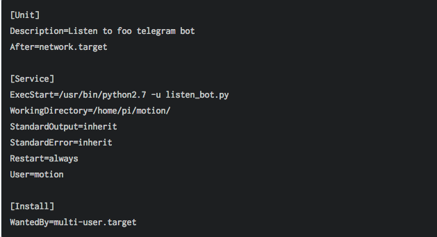
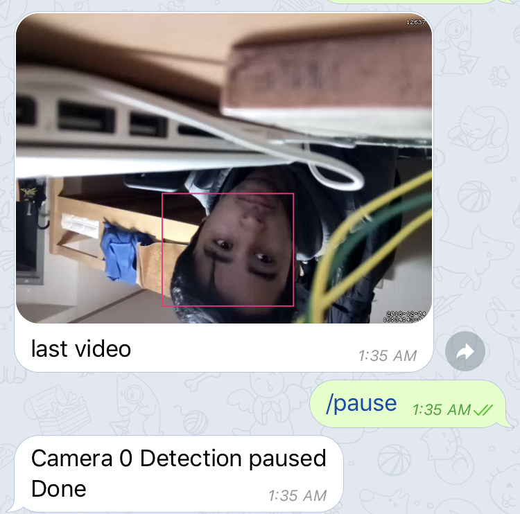
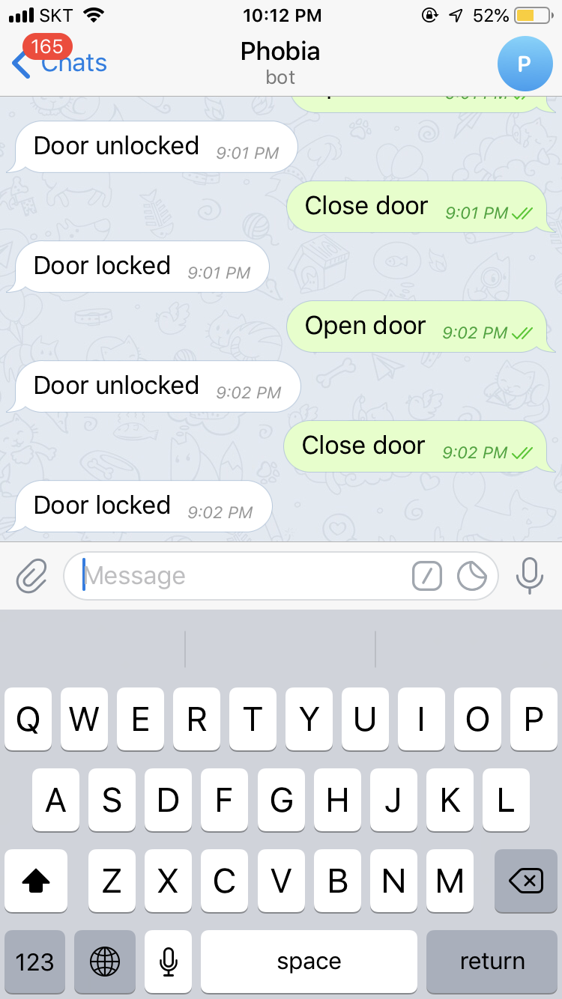

# Telegram home

## materials 
<ul>
  
<li>Raspberry pi – mini computer</li>
<li>Streaming camera or Raspberry pi camera</li>
<li>Servo motor – to control the lock</li>
<li>LED Lights – to show the lock condition (open/close)</li>
<li>Software(Language):</li>
<li>Python</li> 
<li>Telepot, Motion</li> 
</ul>

## Setting up Pi

### install Raspebbry pi 

https://thepi.io/how-to-install-raspbian-on-the-raspberry-pi/

## Steps 

1. Step 1
    Get your Raspberry Pi from Here.
    - sudo apt update

    2. Step 2

    Run raspi config and enable camera module

    - sudo raspi-config

    3. Step 3
    
    Now you can install motion by running the command

    -sudo apt install motion

    its time to edit configuration file

    -sudo nano /etc/motion/motion.conf

### create mybot
here is great <a href="https://www.instructables.com/id/Set-up-Telegram-Bot-on-Raspberry-Pi/"> tutorial </a> for this

### install telepot
pip install telepot

#### after installing telepot . Now if the both listen_bot.py and motion -c ~/motion/motion.conf are running, the system should work.

#### creating service 
ere, the following is working, but I am sure this is the right way to do, so use we care.
add the file listen.service in the folder /etc/systemd/system and type thsese codes.

#####run the service
##### pi@raspberrypi:/etc/systemd/system $ service listen status

### here is example of motion detected

## Setting up Servo and LED
### set up servo and LED to GPIO by following this picture

 
### Test your code 

## Finally build model of the door

